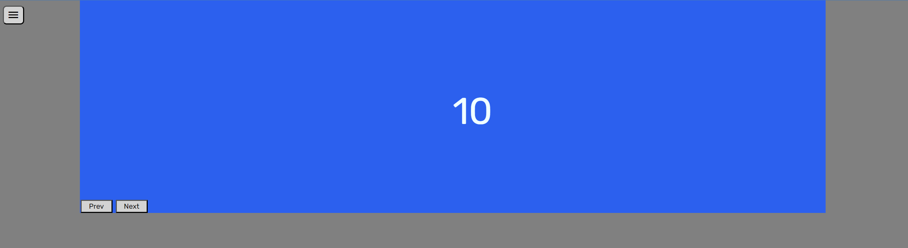

*README*

Goal of this project was to create slideshow with features:

navigation menu show/hide,
add slide,
reset slides to default three slides, 
dark-mode,
saving data in local storage, so after refreshing webpage, everything stays as you left it.

Project was made with 2 .js files written in javascript and jQuery (same logic but one file is written in clean javascript and other in clean jQuery), HTML and CSS.
Default code included in HTML is jQ_app.js (jQuery).